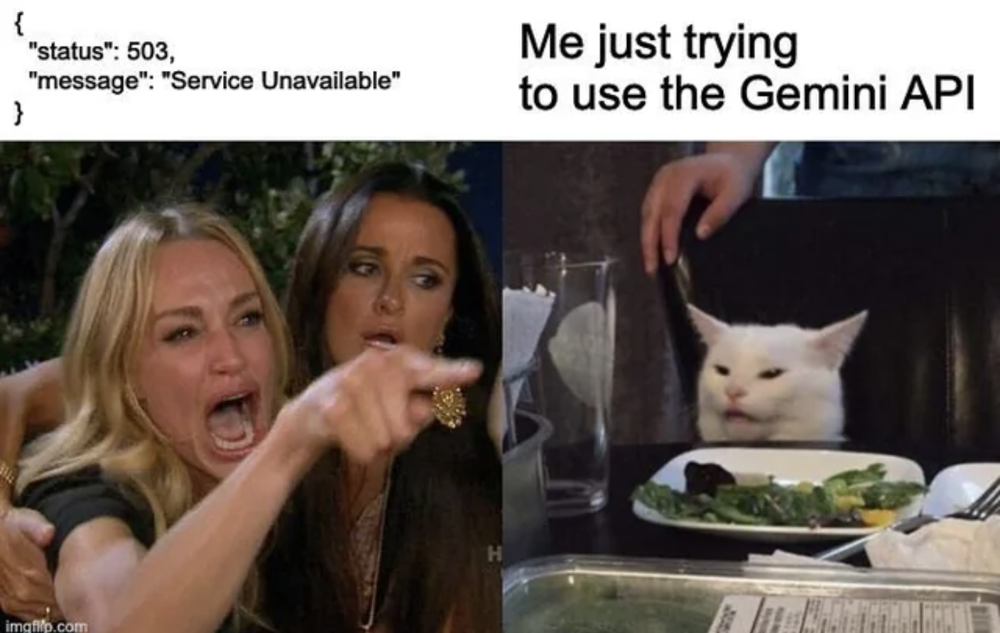

# Welcome to **Mission 3** 🚀

## Overview
A React frontend service for a mock job interview. GIves the user an intuitive interface to use and access the backend application powered by Google Gemini. This app starts with the name and job title being applied for then proceeds to conduct an interview via chat:

- The display starts with a request for a name and job title

- Once filled it starts the interview conversation by asking the user about themself

- The user will then respond to the questions. After each answer another question will be asked

- At the end, the user receives feedback on their performance and suggestions for improvement.

#### Tech Stack

- React
- HTML
- CSS


#### Future Enhancements

- Improve message readability
- Add visual prompts to tell user that the app is loading
- Add a reset button to start a new chat rather than having to refresh the page

#### Setup Instruction:

**Clone the repository**

```bash
git clone <repo-url>
cd Mission_3_Frontend
```

**Install dependencies**

```bash
npm install
```

**Getting started**

```
npm run dev
```

Don't forget to download the backend as well from: [Backend](https://github.com/christinemr/L5-Mission3-backend.git)

---


#### 👩🏻‍💻🧑🏻‍💻👨🏻‍💻 Dev mode vibes

Please sit back and relax while Gemini does the interviewing...

